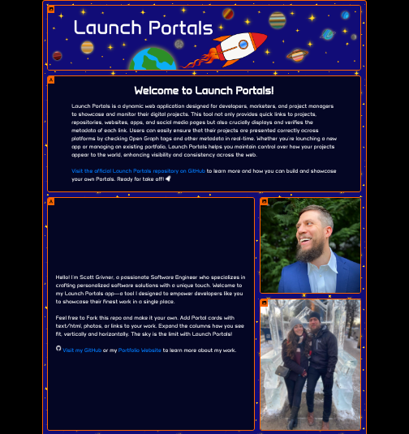
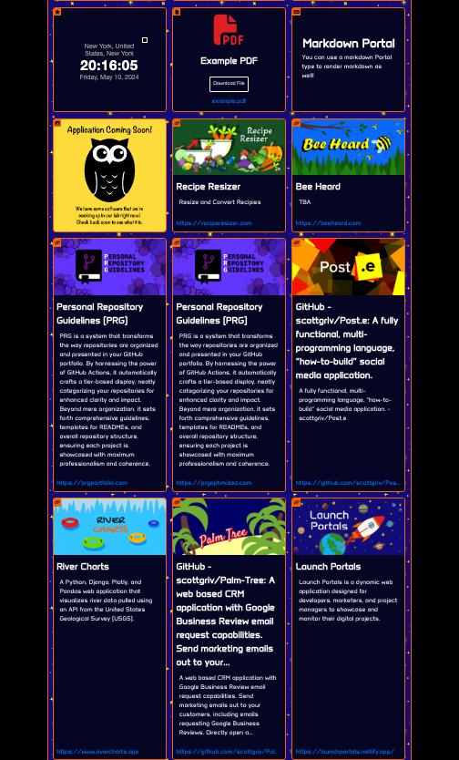
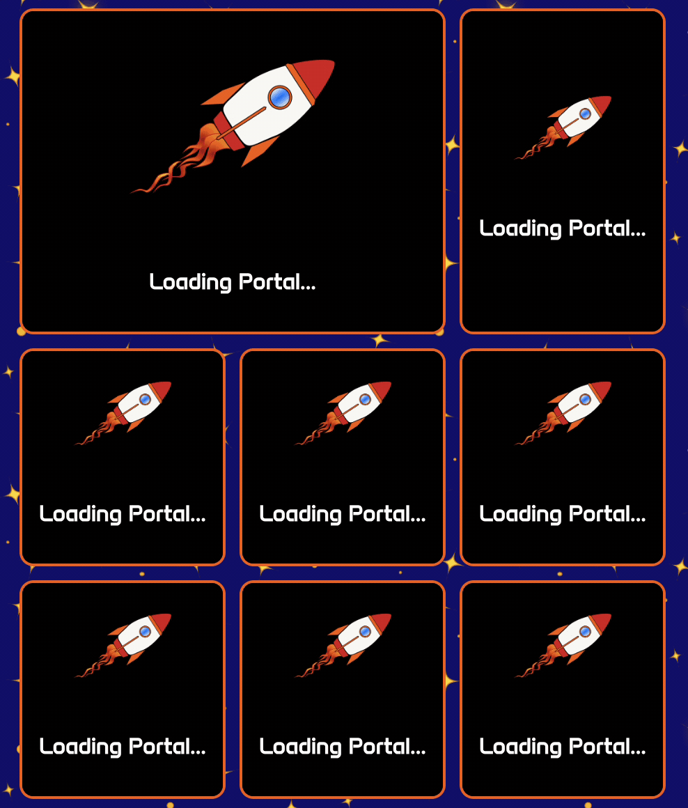

<!-- Begin README -->

[](https://launchportals.netlify.app/)

<p align="center">
    <a href="https://www.gatsbyjs.com/"></a>
    <a href="https://react.dev/"></a>
    <a href="https://www.netlify.com/"></a>
    <br>
    <a href="https://github.com/scottgriv"></a>
    <a href="mailto:scott.grivner@gmail.com"></a>
    <a href="https://www.buymeacoffee.com/scottgriv"></a>
    <br>
    <a href="https://prgportfolio.com"></a>
</p>

---------------

<h1 align="center">🚀 Launch Portals 🚀</h1>

<p align="center">
    <a href="https://app.netlify.com/sites/launchportals/deploys"></a>
</p>

Launch Portals is a dynamic web application designed for developers, marketers, and project managers to showcase and monitor their digital projects. This tool not only provides quick links to projects, repositories, websites, apps, and social media pages but also crucially displays and verifies the metadata of each link. 

Users can easily ensure that their projects are presented correctly across platforms by checking Open Graph tags and other metadata in real-time. Whether you're launching a new app or managing an existing portfolio, Launch Portals helps you maintain control over how your projects appear to the world, enhancing visibility and consistency across the web.

Feel free to Fork this repo and make it your own. Add **Portal** cards with plaintext (and/or HTML), markdown, photos, files, or links to your work. Expand the columns how you see fit, vertically and horizontally. The sky is the limit with Launch Portals!

- Visit the application to see it in action [here](https://https://launchportals.netlify.app/).

<div align="center">
    <a href="https://launchportals.netlify.app/" target="_blank">
        
        <br>
        
    </a>
    <br>
    <i>Fully customizable "Portals".</i>
</div>
<br>
<div align="center">
    <a href="https://launchportals.netlify.app/" target="_blank">
        
    </a>
    <br>
    <i>Error handling if content cannot be rendered.</i>
</div>
<br>

---------------

## Table of Contents

- [Features](#features)
- [Background Story](#background-story)
- [Getting Started](#getting-started)
    - [Installation & Set Up](#installation--set-up)
    - [Building and Running for Production](#building-and-running-for-production)
    - [Configuration](#configuration)
    - [Customization](#customization)
- [Portals](#portals)
    - [What's a Portal?](#whats-a-portal)
    - [Portal Setup](#portal-setup)
    - [Portal Types](#portal-types)
- [Closing](#closing)
- [What's Next?](#whats-next)
- [Project](#project)
- [Contributing](#contributing)
- [Resources](#resources)
- [License](#license)
- [Credit](#credit)

## Features

- [x] Fully customizable
- [x] Mobile friendly
- [x] Easy navigation
- [x] Quick to get up and running with your own variation
- [x] Up arrow for easy page scrolling
- [x] Free to host and deploy using Netlify and GitHub

## Background Story

I wanted to create a website that showcased my projects without adding my product designs to my repository. I decided to use an API to call and render my product images using the `<meta>` tags in the `<head>` tag of my websites. This way, I could verify I correctly set up each `meta` tag to ensure **SEO** optimization. I also wanted to add photos, files, social profiles, and other content to my website to make it more personal.

## Getting Started

### Installation & Set Up

1. Install the Gatsby CLI

   ```sh
   npm install -g gatsby-cli
   ```

2. Run the development server

   ```sh
   gastby develop
   ```

3. View the website at `http://localhost:8000`

### Building and Running for Production

1. Generate a full static production build

   ```sh
   gatsby build
   ```

2. Preview the site as it will appear once deployed

   ```sh
    gatsby serve
    ```

3. View the website at `http://localhost:9000`
4. Commit to GitHub
5. Create a new site on Netlify
6. Connect your GitHub account
7. Select your repository
8. Click `Deploy Site`
9. View your website at `https://<your-site-name>.netlify.app`
10. Optionally, you can also setup a custom domain name for your website
11. If you plan on deploying to Netlify, you can optionally download [Netlify CLI](https://docs.netlify.com/cli/get-started/) to run Netlify functions on your local to ensure proper integration come deployment time.

### Configuration

You can easily configure this website to your liking by following the steps below, changing it from a full website to a preview landing page for your product or app:

1. Open the `src/components/config.js` file
2. Update the `config` object with your information

    ```js
    export const CONFIG = {
        localTesting: false, // Set to true to use Netlify's Server Caching
        showPortalIcons: true, // Set to true to show the Portal type icon in the upper left hand corner of the portal
    };

    ```
> [!NOTE]
> I used [Microlink API](https://microlink.io/) to pull the `meta` tags from my websites into structured data to be displayed in each **Portal**.
> Because the free tier is subject to a soft limit of [50 unauthenticated requests a day](https://microlink.io/docs/api/basics/rate-limit), I decided to use Netlify functions to cache the data server side. If you're testing on local, I cache it in the browser. So be sure to set `localTesting` to `true` if you're developing on your local, otherwise it should be set to `false` for Netlify depoloyment. 

### Customization

Below is a list of the main files you can customize to your liking:

1. `src/components/config.js` - contains the site configuration (see above).
2. `src/components/custom` - custom portal styles and code goes here.
3. `src/components/PortalGrid.js` - the main driving logic of the website.
4. `src/components/layout.css` - the main `CSS` file of the website.
5. `src/components/seo.js` - contains the site SEO. You can easily customize the SEO by editing the `siteMetadata` tree.
6. `src/images` - directory contains the `icon.png` used for the site favicon and other places a small icon is needed.
7. `src/pages/index.js` - site index file.
8. `src/portals` - place your portals here, each `markdown` file will be a card/block inside the overall grid.
9. `src/styles/global.css` - global `CSS` styles, adjust the color and font in this file for overall customization to fit your needs.
10. `src/templates/portalTemplate.js` - template file used with `PortalGrid.js`.
11. `static/files` - place your files for your **file** portal types here.
12. `static/images` - place your images for your **photo** portal types here.
13. `netlify/functions/fetchMetadata.js` - server side function for requesting site metadata using [Microlink API](https://microlink.io/).
13. `netlify.toml` - used to setup the Netlify directory above for the server side.
14. In the root directory, you can also edit the `gatsby-config.js` file to change the site metadata, colors, titles, and other information.

## Portals

### What's a Portal?

A **Portal** is what I refer to as a dynamic card that goes inside the overall **Launch Portals** column/row based grid.
There are a few different types of **Portals** you can utilize out of the box, more on that below.

Inside the `src/portals` directory, you can add `markdown` files with information about each of your portals.
- I like to name the file using the following naming convention:
- `A-B-C-D.md`
        - `A` = Portal Order
        - `B` = Portal Type
        - `C` = Project Type
        - `D` = Project Name
- Examples:
        - `1-Photo-Banner.md`
        - `9-Custom-Clock.md`
        - `10-File-Resume.md`
        - `11-Markdown-Example.md`
        - `32-Link-Social-GitHub.md`

> [!TIP]
> This naming convention is of course optional, the application does not care what the name of the files are, just that its a `.md` extension and that its properly formatted to pick up your **Portal** information.

Add as many **Portals** you like and the application will loop through this folder to display each one.

### Portal Setup

Utilize the following query parameters for `GraphQL` to render your **Portal** content.
     
1. `type: String` - see the breakdown of [Portal Types](#portal-types) below.
2. `order: Int` - this is the order you want your **Portals** to appear in the overall **Launch Portals** grid.
3. `text: String` - text used for `text` **Portal** types, this also supports `HTML` formatting/tags.
4. `markdown: String` - write markdown in this field for the `markdown` **Portal** type.
5. `photo: String` - put your url path (pointing towards `static/images`) of your photo you'd like to use for a `photo` **Portal** type.
6. `file: String` - put your url path (pointing towards `static/files`) of your file you'd like to use for a `file` **Portal** type.
7. `fileTitle : String` - the title you would like to use to display your `file` **Portal** type.
8. `link: String` - put your url path (external) to your website you would like to display using a `link` **Portal** type.
9. `custom: String` - use a keyword here to describe your `custom` **Portal** type. You will need to adjust the logic in the `src/components/PortalGrid.js` file to handle this.
10. `vportals: Int` - adjust how many **Portals** your single **Portal** will expand *vertically*. 
11. `hportals: Int` - adjust how many **Portals** your single **Portal** will expand *horizontally*.

> [!IMPORTANT]
> Regarding `vportals` above, there is no limit on how many **Portals** your content can take up, but keep in mind, it may give off a strange appearance if you're crossing too many **Portals** at once so you may need to tinker around with it.
> Regarding `hportals` above, the max is `3` across on Desktop, and `2` across on mobile.
> **Portals** that expand `3` across will automatically be rendered to `2` on mobile, so please keep this in mind. It's important to check both Desktop and Mobile layouts to ensure you're satisfied with the layout.

### Portal Types

Regarding `#1` above, `type`, there are **6** different **Portal** types you can utilize.
- Place the type you want to use in `type` query parameter.


1. **text** - display `text` or `HTML`.


2. **markdown** - display `markdown`.


3. **photo** - display an `image`.


4. **file** - host a downloadable `file`.


5. **link** - `link` to an external website or project.


6. **custom** - use a **keyword** here to use inside the `custom` `switch` statement logic in the `renderPortalContent` function inside the `src/components/PortalGrid.js` file.


7. **unknown** - this is not an actual type, but a placeholder will be used if a valid type is not found above.

> [!WARNING] 
> Be sure to add the **keyword** you used inside of the **custom** tag above inside the `switch` statement.
> Example:

```js
{node.frontmatter.custom === "animation" ? (
<PortalAnimation />
) : node.frontmatter.custom === "clock" ? (
<ClockWidget />
)
```

> [!NOTE]
> Each **Portal** type has an icon indicator associated with it, located in the upper left hand corner of each **Portal**.
> You can disable this indicator by setting `showPortalIcons` to `false` in the `config.js` file if you do not want to display it.

## Closing

Thank you for taking the time to read through this document and I hope you find it useful!
If you have any questions or suggestions, please feel free to reach out to me.
> Please reference the [SUPPORT](.github/SUPPORT.md) file in this repository for more details

## What's Next?

I'm looking forward to seeing how this project evolves over time and how it can help others with their GitHub Portfolio.
> Please reference the [CHANGELOG](.github/CHANGELOG.md) file in this repository for more details.

## Project

Please reference the [GitHub Project](https://github.com/users/scottgriv/projects/12) tab inside this repository to get a good understanding of where I'm currently at with the overall project.

- Issues and Enhancements will also be tracked there as well.

## Contributing

Feel free to submit a pull request if you find any issues or have any suggestions on how to improve this project. You can also open an issue with the tag "bug" or "enhancement".

- How to contribute:

1. Fork the Project
2. Create your Feature Branch (`git checkout -b feature/Business-Website`)
3. Commit your Changes (`git commit -m 'Add new feature'`)
4. Push to the Branch (`git push origin feature/Business-Website`)
5. Open a Pull Request

> Please reference the [CONTRIBUTING](.github/CONTRIBUTING.md) file in this repository for more details.

## Resources

- [Gatsby](https://www.gatsbyjs.com/) - A framework for building static websites and web applications using React.
- [Gatsby - SEO Component](https://www.gatsbyjs.com/docs/how-to/adding-common-features/adding-seo-component/) - A guide for adding SEO optimizations to Gatsby projects.
- [Netlify](https://www.netlify.com/) - A platform for hosting static sites with automatic deployment from Git repositories.
- [Netlify CLI](https://docs.netlify.com/cli/get-started/) - Netlify’s command line interface (CLI) lets you configure continuous deployment straight from the command line. You can use Netlify CLI to run a local development server that you can share with others, run a local build and plugins, and deploy your site.
- [React](https://reactjs.org/) - A JavaScript library for building dynamic user interfaces.
- [Font Awesome](https://fontawesome.com/) - A toolkit for web icons and social logos, customizable via CSS.
- [Meta Tags](https://metatags.io/) - A tool for previewing and generating meta tags for better SEO and social media sharing.
- [Microlink API](https://microlink.io/) - An API for turning websites into structured data.
- [Microlink API - Rate Limits](https://microlink.io/docs/api/basics/rate-limit) - Documentation on the usage limits of the Microlink API.
- [Meta Tags: What They Are & How to Use Them for SEO](https://www.semrush.com/blog/meta-tag/) - Meta Tag for SEO Guide.
- [SEO Basics: How to Do SEO for Beginners](https://www.semrush.com/blog/seo-basics) - Search Engine Optimization Guide.

## License

This project is released under the terms of the **GNU General Public License, version 3 (GPLv3)**.
- The GPLv3 is a "copyleft" license, ensuring that derivatives of the software remain open source and under the GPL.
- For more details and to understand all requirements and conditions, see the [LICENSE](LICENSE) file in this repository.

## Credits

**Author:** [Scott Grivner](https://github.com/scottgriv) <br>
**Email:** [scott.grivner@gmail.com](mailto:scott.grivner@gmail.com) <br>
**Website:** [scottgrivner.dev](https://www.scottgrivner.dev) <br>
**Reference:** [Main Branch](https://github.com/scottgriv/Launch-Portals) <br>

---------------

<div align="center">
    <a href="https://github.com/scottgriv/Launch-Portals" target="_blank">
        
    </a>
</div>

<!-- End README -->
